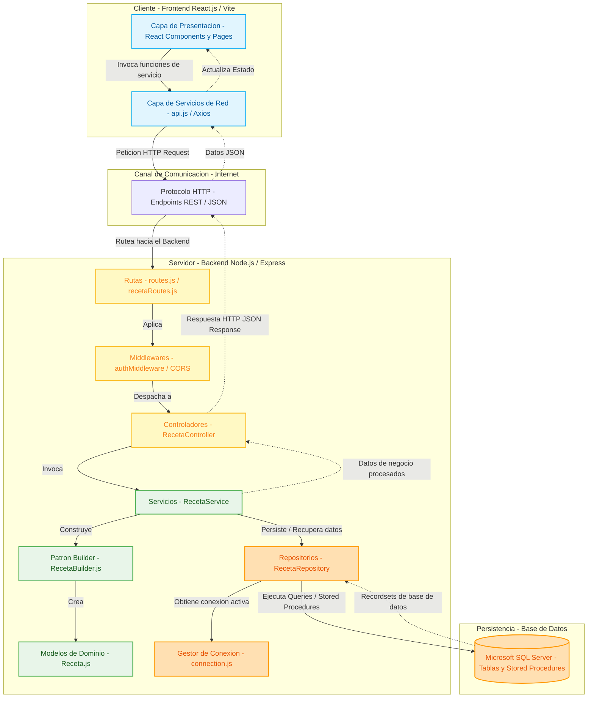

# Arquitectura del Sistema: Cliente-Servidor y Capas

El sistema está diseñado bajo un modelo híbrido que combina la arquitectura **Cliente-Servidor** con una arquitectura de **N-Capas (o Capas Lógicas)** en el backend y el frontend. Esta separación de responsabilidades asegura modularidad, facilidad de mantenimiento y desacoplamiento entre la interfaz de usuario, las reglas de negocio y el almacenamiento de datos.

---

## Diagrama de Arquitectura (Mermaid)

El siguiente diagrama detalla cómo se estructuran las capas lógicas y cómo fluye la información entre el Cliente (Frontend) y el Servidor (Backend) a través de llamadas RESTful.

---

## Descripción Detallada de las Capas

### 1. Cliente (Frontend - React + Vite)
El frontend actúa como la interfaz interactiva para el usuario final. Está desacoplado del backend y se compone de:
*   **Capa de Presentación (React Components & Pages):** Gestiona la UI y el estado de la vista. Se encarga de pintar elementos visuales como formularios de recetas, listados, barras de búsqueda y filtros.
*   **Capa de Servicios de Red (`src/services/api.js`):** Encapsula todas las llamadas HTTP al backend. Esto previene que los componentes interactúen directamente con URLs de la API, centralizando el manejo de peticiones y cabeceras de autorización.

### 2. Protocolo de Comunicación
*   **HTTP / REST (JSON):** El canal que une frontend y backend. Las peticiones viajan mediante verbos HTTP estándar (`GET`, `POST`, `PUT`, `DELETE`) y el payload es estructurado en formato JSON.

### 3. Servidor (Backend - Node.js + Express)
El backend procesa las solicitudes recibidas y aplica las reglas de negocio sobre los datos persistidos. Se organiza en las siguientes capas lógicas:

#### A. Capa de Entrada y Ruteo (Rutas, Middlewares y Controladores)
Es la puerta de entrada a la aplicación.
*   **Rutas (`routes/`):** Definen los endpoints de la API expuestos al cliente (ej. `/api/recetas`).
*   **Middlewares (`middlewares/`):** Funciones intermedias para interceptar peticiones. Principalmente manejan el control de acceso y validación de tokens de sesión (`authMiddleware`).
*   **Controladores (`controllers/`):** Extraen los parámetros de la petición HTTP (body, query params, path params), invocan la capa de negocio y serializan el resultado de vuelta como una respuesta JSON o código de estado HTTP adecuado.

#### B. Capa de Lógica de Negocio (Servicios)
*   **Servicios (`services/`):** Aquí vive el core de las reglas del negocio (ej. `RecetaService.js`). Realiza validaciones conceptuales (como verificar ingredientes válidos, duplicados o calcular información nutricional) antes de orquestar operaciones con la persistencia.

#### C. Capa de Dominio / Entidades
*   **Modelos y Builders (`models/`):** Representa el modelo lógico del dominio de recetas. Se utiliza el **Patrón Builder** (`RecetaBuilder.js`) para instanciar recetas complejas paso a paso con validaciones estructurales propias del objeto de dominio (`Receta.js`).

#### D. Capa de Acceso a Datos (Repositorios)
*   **Repositorios (`repositories/`):** Abstraen el origen de los datos (ej. `RecetaRepository.js`). Encapsulan la lógica SQL y la ejecución de procedimientos almacenados. De esta forma, si el motor de base de datos cambiara en el futuro, solo se modificaría esta capa.
*   **Conexión (`database/connection.js`):** Gestiona el pool de conexiones activas con Microsoft SQL Server usando el controlador `mssql`.

#### E. Base de Datos (Persistencia)
*   **Microsoft SQL Server:** Almacena físicamente las tablas relacionales (`RECETA`, `INGREDIENTE`, `INSTRUCCIONES`, etc.) y expone lógica en base de datos mediante **Procedimientos Almacenados (Stored Procedures)** como `sp_crear_receta` y `sp_agregar_instruccion`.

---

## Patrones de Diseño Clave Utilizados

1.  **Patrón Repository (Repositorio):** Aísla la capa de negocio de los detalles de SQL Server.
2.  **Patrón Builder (Constructor):** Facilita la creación del objeto complejo `Receta` configurando dinámicamente sus ingredientes, instrucciones e información nutricional paso a paso.
3.  **Separación de Conceptos (SoC - Separation of Concerns):** El frontend no sabe cómo se guardan los datos en SQL Server; el backend no sabe cómo se renderizan los datos en React.
