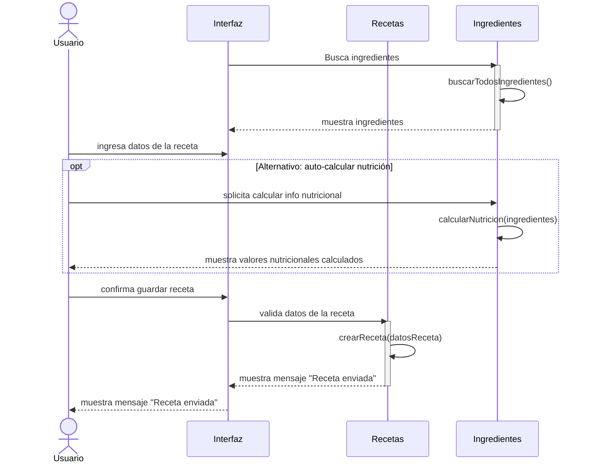
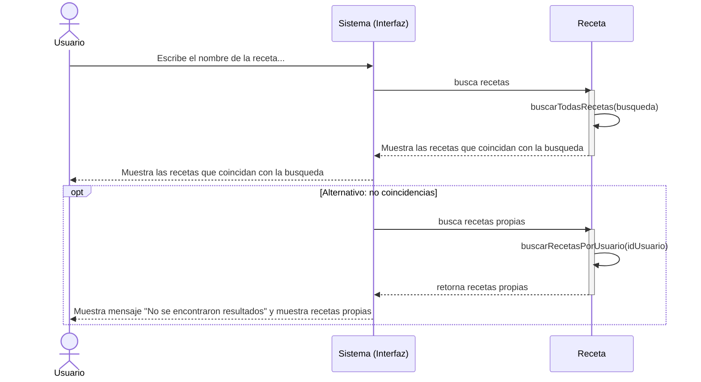
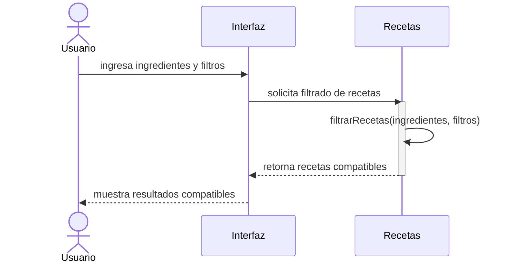

# Diagramas de Secuencia

## 1. Crear Receta

```mermaid
sequenceDiagram
    actor Usuario
    participant Interfaz
    participant Recetas
    participant Ingredientes

    Interfaz->>Ingredientes: Busca ingredientes
    activate Ingredientes
    Ingredientes->>Ingredientes: buscarTodosIngredientes()
    Ingredientes-->>Interfaz: muestra ingredientes
    deactivate Ingredientes

    Usuario->>Interfaz: ingresa datos de la receta
    
    opt Alternativo: auto-calcular nutrición
        Usuario->>Ingredientes: solicita calcular info nutricional
        Ingredientes->>Ingredientes: calcularNutricion(ingredientes)
        Ingredientes-->>Usuario: muestra valores nutricionales calculados
    end

    Usuario->>Interfaz: confirma guardar receta
    
    Interfaz->>Recetas: valida datos de la receta
    activate Recetas
    Recetas->>Recetas: crearReceta(datosReceta)
    Recetas-->>Interfaz: muestra mensaje "Receta enviada"
    deactivate Recetas
    
    Interfaz-->>Usuario: muestra mensaje "Receta enviada"
```

## 2. Buscar Receta

```mermaid
sequenceDiagram
    actor Usuario
    participant Sistema as Sistema (Interfaz)
    participant Receta

    %% Hack para bajar la flecha: agregar un salto de linea transparente
    Usuario->>Sistema: Escribe el nombre de la receta...
    Sistema->>Receta: busca recetas
    activate Receta
    Receta->>Receta: buscarTodasRecetas(busqueda)
    Receta-->>Sistema: Muestra las recetas que coincidan con la busqueda
    deactivate Receta
    Sistema-->>Usuario: Muestra las recetas que coincidan con la busqueda

    opt Alternativo: no coincidencias
        
        Sistema->>Receta: busca recetas propias
        activate Receta
        Receta->>Receta: buscarRecetasPorUsuario(idUsuario)
        Receta-->>Sistema: retorna recetas propias
        deactivate Receta
        
        Sistema-->>Usuario: Muestra mensaje "No se encontraron resultados" y muestra recetas propias
    end
```

## 3. Gestión de Recetas - Filtrar Receta

```mermaid
sequenceDiagram
    actor Usuario
    participant Interfaz
    participant Recetas

    Usuario->>Interfaz: ingresa ingredientes y filtros
    
    Interfaz->>Recetas: solicita filtrado de recetas
    activate Recetas
    Recetas->>Recetas: filtrarRecetas(ingredientes, filtros)
    Recetas-->>Interfaz: retorna recetas compatibles
    deactivate Recetas
    
    Interfaz-->>Usuario: muestra resultados compatibles
```
