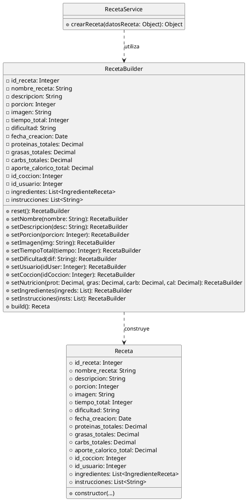

# Plan de Implementación: Sistema de Recetas

Este plan detalla los cambios para añadir la creación de ingredientes en la página de cocina, reestructurar la creación de recetas en una nueva página interactiva con pasos de instrucciones y enlace visual de ingredientes ya creados, e implementar el patrón de diseño Builder para la construcción del objeto `Receta`.

## User Review Required

> [!IMPORTANT]
> - **Rutas del Frontend**: Añadiremos la ruta `/crear-receta` para el proceso de creación en una página dedicada, y deshabilitaremos la apertura del modal en `App.jsx`, redirigiendo en su lugar.
> - **Procedimientos Almacenados**: Se utilizará `sp_crear_ingrediente` para guardar nuevos ingredientes. Hemos identificado que la base de datos no incluye `@id_coccion` en los parámetros de este procedimiento, por lo que actualizaremos la llamada en el repositorio para evitar errores.
> - **Múltiples Instrucciones**: La base de datos soporta múltiples filas en `INSTRUCCIONES` asociadas a una receta mediante `sp_agregar_instruccion`. Ajustaremos el repositorio para realizar bucles en caso de recibir múltiples instrucciones y almacenarlas correctamente con su respectivo `num_paso`.

## Proposed Changes

---

### Backend

#### [NEW] [RecetaBuilder.js](file:///c:/React/Sistema_Recetas-1/backend/src/models/RecetaBuilder.js)
- Crear una nueva clase `RecetaBuilder` utilizando el patrón de diseño **Builder** para encapsular la construcción paso a paso de objetos `Receta`.

#### [MODIFY] [RecetaService.js](file:///c:/React/Sistema_Recetas-1/backend/src/services/RecetaService.js)
- Utilizar `RecetaBuilder` para construir la instancia de `Receta` a partir de los datos recibidos del frontend.
- Adaptar las validaciones para manejar tanto un arreglo de instrucciones como un string plano.

#### [MODIFY] [RecetaRepository.js](file:///c:/React/Sistema_Recetas-1/backend/src/repositories/RecetaRepository.js)
- Ajustar el guardado de instrucciones en el repositorio. Si `receta.instrucciones` es un arreglo, iterar para insertar cada elemento llamando a `sp_agregar_instruccion` con su respectivo `num_paso`.

#### [MODIFY] [IngredienteRepository.js](file:///c:/React/Sistema_Recetas-1/backend/src/repositories/IngredienteRepository.js)
- Ajustar el método `crear` para invocar a `sp_crear_ingrediente` enviando exactamente los parámetros que el procedimiento almacenado espera (`@nombre`, `@calorias`, `@proteinas`, `@carbs`, `@grasas`, `@icono`).

#### [MODIFY] [IngredienteService.js](file:///c:/React/Sistema_Recetas-1/backend/src/services/IngredienteService.js)
- Añadir el método `crearIngrediente(datosIngrediente)` para validar y enviar el nuevo ingrediente al repositorio.

#### [MODIFY] [IngredienteController.js](file:///c:/React/Sistema_Recetas-1/backend/src/controllers/IngredienteController.js)
- Añadir el método `crear = async (req, res)` para manejar solicitudes POST e invocar al servicio de creación de ingredientes.

#### [MODIFY] [ingredienteRoutes.js](file:///c:/React/Sistema_Recetas-1/backend/src/routes.js/ingredienteRoutes.js)
- Registrar la ruta `POST /ingredients` asociándola a `controller.crear`.

---

### Frontend

#### [MODIFY] [api.js](file:///c:/React/Sistema_Recetas-1/src/services/api.js)
- Añadir la función `crearIngrediente(form)` que realiza una petición `POST` a `/api/ingredients`.

#### [MODIFY] [utils.js](file:///c:/React/Sistema_Recetas-1/src/services/utils.js)
- Modificar `validarCamposReceta` para validar correctamente cuando las instrucciones vienen en formato de arreglo.

#### [MODIFY] [App.jsx](file:///c:/React/Sistema_Recetas-1/src/App.jsx)
- Importar y registrar la nueva página `CreateRecipePage` bajo la ruta `/crear-receta`.
- Cambiar la acción al pulsar "Crear receta" en el Header para redirigir a `/crear-receta` en lugar de abrir el modal anterior.

#### [MODIFY] [CookingPage.jsx](file:///c:/React/Sistema_Recetas-1/src/pages/CookingPage.jsx) y [CookingPage.css](file:///c:/React/Sistema_Recetas-1/src/pages/CookingPage.css)
- Incorporar una sección/modal atractiva en el panel lateral para "Crear Ingrediente".
- Implementar el formulario para capturar: nombre, icono (lista de emojis comunes o texto), calorías, proteínas, carbs y grasas.
- Al guardar correctamente, llamar al endpoint del backend, limpiar el formulario, notificar al usuario y actualizar la lista local de ingredientes para su uso en la olla.

#### [NEW] [CreateRecipePage.jsx](file:///c:/React/Sistema_Recetas-1/src/pages/CreateRecipePage.jsx) y [CreateRecipePage.css](file:///c:/React/Sistema_Recetas-1/src/pages/CreateRecipePage.css)
- Crear una nueva página dedicada para la creación de recetas que sea visualmente espectacular:
  - Diseño responsivo, colores coordinados y animaciones fluidas.
  - **Paso 1: Información General**: Nombre de receta, descripción breve, porción, tiempo, dificultad y URL de imagen.
  - **Paso 2: Ingredientes Seleccionables**: Un buscador interactivo y selector visual de ingredientes ya creados de la base de datos. Al hacer clic en un ingrediente, se añade a la receta y permite ingresar la cantidad y unidad con campos dinámicos.
  - **Paso 3: Pasos de Instrucción**: Un listado de pasos dinámico. El usuario puede añadir pasos secuenciales redactando el texto de cada instrucción.
  - **Paso 4: Información Nutricional**: Entradas numéricas para proteínas, grasas, carbohidratos y calorías totales, con una opción opcional de *Auto-calcular* en base a los ingredientes seleccionados y sus valores nutricionales por cada 100g.
- Utilizar la llamada `publicarReceta` para enviar la información estructurada a la API al finalizar.

---

## Patrón de Diseño Utilizado: Builder Pattern

### Justificación

La clase `Receta` representa un modelo de negocio complejo. Requiere gran cantidad de propiedades opcionales u obligatorias (nombre, descripción, porciones, tiempo, dificultad, imagen, información nutricional anidada, arreglos de ingredientes vinculados y pasos de instrucción secuenciales). 

Utilizar un constructor directo para este tipo de estructuras complejas (telescoping constructor) suele derivar en código confuso y propenso a errores al requerir pasar múltiples valores nulos o vacíos en orden específico. El patrón **Builder** nos permite:
1. Separar la lógica de construcción del objeto de su representación final.
2. Construir el objeto paso a paso de forma legible y autodescriptiva (ej. `builder.setNombre().setTiempoTotal().build()`).
3. Validar y procesar cada componente individualmente antes de la instanciación de `Receta`.

### Diagrama de Clases (PlantUML)

---

## Verification Plan

### Automated Tests
Para verificar que el backend levanta y los endpoints responden, usaremos comandos del sistema y peticiones curl/fetch o levantando el servidor node localmente:
- `npm run dev` para la interfaz de React.
- `node backend/server.js` para el backend.

### Manual Verification
- **Creación de Ingrediente**: Acceder a `/cocina`, pulsar en "Nuevo Ingrediente", llenar los campos del formulario y enviarlo. Confirmar que aparece instantáneamente en el listado para poder agregarlo a la olla.
- **Creación de Receta**: Redirigir a `/crear-receta`, completar el formulario paso a paso.
  - Seleccionar ingredientes creados anteriormente agregándoles cantidad y unidad.
  - Agregar varios pasos de instrucción.
  - Probar el auto-cálculo nutricional opcional.
  - Guardar y confirmar que la receta se lista con todos sus ingredientes y pasos al consultarla.
